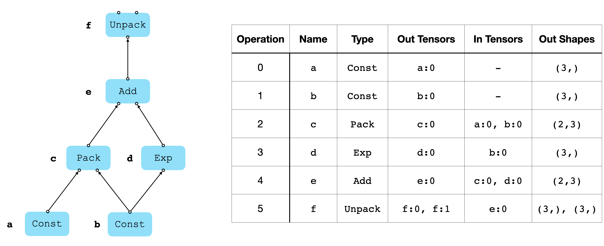
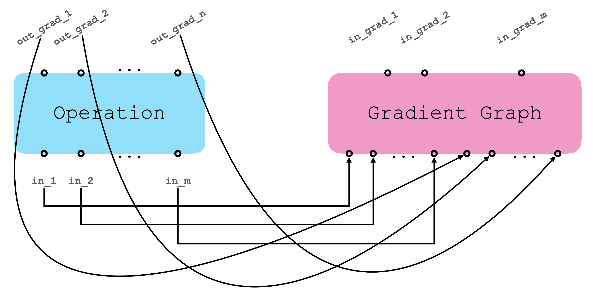
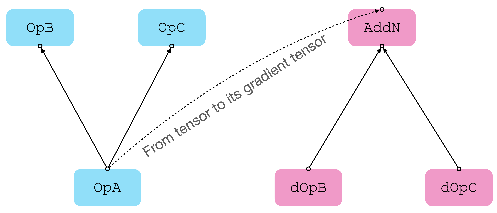
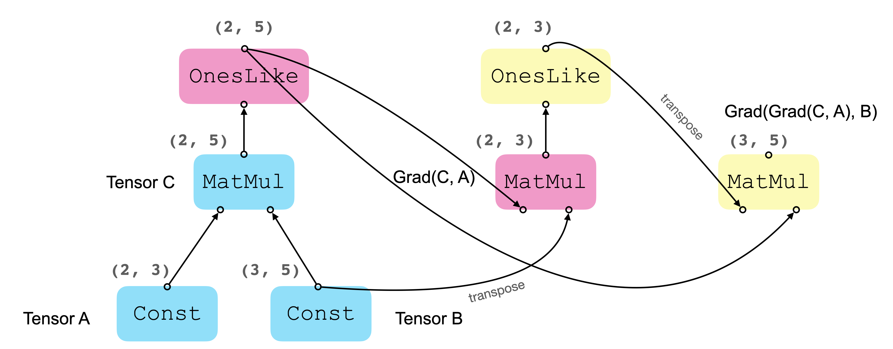

# AutoGrad: NumPy-based Framework for Automatic Differentiation


## Introduction

This is a project that I've been contemplating over the years but not able to finish until just recently. The motivation was to demystify how backpropagation algorithm works in machine learning libraries like TensorFlow, which allows you to take a differentiable computational graph and efficiently compute the gradients (first or higher order). The basic idea is to try to build a "mini" framework from the ground up based on the general principles of differentiation and the chain rule of derivatives. By "mini" I mean I try to keep the implementation as minimal as possible by focusing on components that are necessary for defining the graph and computing gradients, so that the codebase is much more readable than a full-fledged library. That said, the collection of Operations in the current version (as of mid 2023) is still reasonably expressive (support math, neural network, N-D array, and data flow operations), which allows you to build common model architectures and can be tested on standard benchmark datasets like [MNIST](http://yann.lecun.com/exdb/mnist/).

**Note**: this repository is only intended for sharing the knowledge about how backpropagation works under the hood, and **not for production purposes** (because it only runs on CPU).

## Design

This section briefly discusses the implementation details. Feel free to skip over to [Quick Start](#quick-start).

### Graph, Operations and Tensors

Generally speaking, running a typical machine learning model comes down to two stages:

1. Symbolically describe the computational process as a directed graph (graph construction or compile time).
2. Carry out the computation by "executing" the graph built in the first stage (runtime).

The Graph is composed of a network of interconnected nodes, called `Operation`s (Ops). Each Op is prescribed to perform a specific type of computation, for example, convoluting an input feature map and a filter into an output feature map. In this case, the Op `Conv2D` takes two input Tensors and generates one output Tensor, where a `Tensor` is just a symbolic representation of an N-D numpy array. Ops can be connected by feeding the output Tensors of one Op as inputs to another Op.

Note that


1. Tensors cannot be created out of thin air --- a Tensor is always emitted by a specific "parent" Op.
2. An Op may receive >= 0 Tensors as inputs and generate >= 0 output Tensors.
3. A Tensor can be uniquely identified by
 * the ID of its parent Op: `Tensor.op`
 * its index in the output list of the parent Op: `Tensor.tensor_index`
4. Some Ops does not require an input. For example, a `Const` (constant) Op spits out a Tensor whose value is provided at graph construction time.
5. Some Ops may have "side-effects". For example, an `AssignVariable` Op will modify the value of variables in the `Runtime` environment.


Once we are done with building the graph, we can carry out the computation defined collectively by Ops in the graph. Take the following diagram for an example, where the graph is drawn on the left hand side, and the Ops and Tensors are listed in the table on the right hand side.

To "carry out the computation" simply means to execute a specific Op in the graph. Let's say we'd like to execute the `Add` Op `e`, which adds the input Tensors `c:0` and `d:0`, which are recursively computed by the `Pack` Op `c` and `Exp` Op `d`, and eventually trace back to the two "leaf" Ops `a` and `b`.


<p align="center">
  
  <br>
  <br>
  Example of a computational graph. Colored (blue) rectangles represent Ops, small black circles underneath and above Ops are input and output tensors, respectively.
</p>

### Runtime

As we just showed, the execution of an Op requires the concrete values (numpy array) of upstream Ops. So we need to temporily store the values of Tensors in an environment called `Runtime`, so that downstream Ops can either invoke the execution of upstream Ops or simply look up the values of the output Tensors. Essentially, a `Runtime` is a dictionary that maps the ID of tensors to their values.

### Backpropagation

For an Op that has `m` inputs and generates `n` outputs, it is expected to receive `n` gradient Tensors from its downstream Ops. A `_grad_func` is defined for each Op that takes the `m` input and `n` gradient Tensors (or a subset of them), and adds additional Ops to the graph that computes the gradient tensors. For example, in the following digram, the blue rectangle on the left represents a single Op with `m` inputs and `n` outputs, and the pink rectangle on the right represent a "subgraph": containing potentially multiple Ops that eventually leads to gradient tensor with respect to each of the `m` input tensors.

<p align="center">
  
  <br>
  <br>
  Generating a subgraph containing Ops that lead to the computed gradient tensors.
</p>

If a Tensor is consumed by more than one downstream Op, a gradient tensor will be backpropped from each of the downstream, and the total gradient is the sum of these gradient tensors, which is computed by the `AddN` Op.

<p align="center">
  
  <br>
  <br>
  Tensor "OpA:0" expects two backpropped gradient tensors ("dOpB:0" and "dOpC:0"). The full gradient will be the sum of them.
</p>

The following is an example of computing gradients (and gradients or gradients) of a graph. First, the three blue rectangles represent the graph of three Ops, which simply computes the dot product of two tensors `A` and `B` of shape `[2, 3]` and `[3, 5]`, respectively. Second, the two pink rectangles represent the graph with additional Ops, computing the gradient of `C` with respect to `A`, i.e. `Grad(C, A)`. Finally, we further add two Ops (yellow) to compute the gradient of `Grad(C, A)` withe respect to `B`, i.e. `Grad(Grad(C, A), B)`.

<p align="center">
  
  <br>
  <br>
  Higher order gradient
</p>

## Codebase


The entire codebase is modularized as follows:
* The base class for all Ops is defined in `operation.py`.
* `Tensor` class is defined in `tensor.py`, and the `TensorShape` class is defined in `tensor_shape.py`.
* The `Graph` and `Runtime` classes are defined in `containers.py`
* Various types of Ops are defined separately in `math_ops.py`, `array_ops.py`, `generic_ops.py`, `data_flow_ops.py`, `nn_ops.py`, `random_ops.py`, `resource_ops.py`.
* The implicit stack of default graph is defined in `default_stack.py`.

On top of the above files, the following files provide interfaces for higher level abstractions (e.g. layers, optimizers, initializers)

* `wrappers.py`: Wrapper functions for creating raw `Operation`s
* `layers.py`: Common neural network layers
* `optimizers.py`: Optimization algorithms for updating weights (e.g. Adam)
* `initializers.py`: Common initialization algorithms (e.g. glorot uniform)
* `mixins`: mix-in classes for `Operation`s


## Installation

### Requirements

Only numpy is required. See `requirements.txt`

Just clone this repository
```
git clone git@github.com:chao-ji/autograd.git /path_to_autograd/autograd
```

then add the directory `/path_to_autograd` to python search paths

```
PYTHONPATH=$PYTHONPATH:/path_to_autograd
```

Start a python shell and run `import autograd as ag` to make sure that installation is successful.

## Quick Start

### Graph and Runtime
Any `Operation`s is defined in a specific `Graph` object.

There are two ways to define a `Graph`. The first is to assume there is an implicit *default* graph.

```python
import autograd as ag

# `a`, `b`, `c` are `Tensor` objects
# `a.op` (and `b.op`, `c.op`) are their parent `Operation`s

# Upon creating `a`, a default graph is implicitly created
a = ag.placeholder(shape=[1, 3])
b = ag.placeholder(shape=[1, 3])
c = a + b # or ag.add(a, b)

# retrieve the implicitly created graph
graph = ag.get_default_graph()

assert a.op.graph == graph
assert b.op.graph == graph
assert c.op.graph == graph
```

The second is to create a graph explicitly and define Ops in a context.

```python
graph = ag.Graph()
with graph.as_default_graph():
  a = ag.placeholder(shape=[1, 3])
  b = ag.placeholder(shape=[1, 3])
  c = a + b

# `graph` is now out-of-scope and `graph2` is a different graph
graph2 = ag.get_default_graph()

assert a.op.graph == graph
assert a.op.graph != graph2
```

`Runtime` is an environment that holds the actual values of `Tensors` and simulates the running of a `Graph`. In a sense, `Graph` is like a **compiled executable**, while `Runtime` is like a **process** in which the `Graph` runs.

```python
graph = ag.Graph()

# `Runtime` is implicitly created when a `Graph` is created.
runtime = graph.runtime

with graph.as_default_graph():
  a = ag.placeholder(shape=[1, 3])
  b = ag.placeholder(shape=[1, 3])
  c = a + b

# We use `Runtime` object to set `Placeholder` values and get the value of the result `Tensor`.

# `Placeholder` type of Tensors have `set_value` method to set their values in Runtime:
import numpy as np
a.set_value(np.arange(3).reshape(1, 3))
b.set_value(np.ones((1, 3)))

# All `Tensor`s have `eval` instance method to retrieve their actual values in Runtime:
print(c.eval())
# output: array([[1., 2., 3.]])

# call `reset()` to reset the values of all tensors in a graph, so we can feed new values to `Placeholder`s and re-run the graph.
runtime.reset()
```


### Backpropagation

To backprop gradient from a tensor `t` to any other tensor `s`, where there is "differentiable path" from `s` to `t`, call

```python
# `grads` is a list holding a Tensor of the same shape as `s`
grads = ag.backprop(y_tensors=[t], x_tensors=[s])
```
The gradient defaults to a tensor of the same shape as `t` and filled with ones.

You can also provide specific values of the the backpropped gradient by setting argument `dy_tensors`:

```python
t_backward_value = ag.ones_like(t) # `t_backward_value` is the backpropped gradient
grads = ag.backprop(y_tensors=[t], x_tensors=[s], dy_tensors=[t_backward_value])
```


The following is example of computing higher order gradients.

```python
import autograd as ag
import numpy as np

# a.shape: (2, 3)
a = ag.constant(np.arange(0, 6).astype("float32").reshape(2, 3))
# b.shape: (3, 5)
b = ag.constant(np.arange(0, 15).astype("float32").reshape(3, 5))
# c.shape: (2, 5)
c = ag.matmul(a, b)

# Backprop gradient of `c` (defaults to ag.ones((2, 5))) to `a`
# grads[0]: [<Tensor 'MatMul_1:0', shape=(2, 3)>]
grads = ag.backprop([c], [a])

# Backprop gradient of `grads[0]` (defaults to ag.ones((2, 3))) to `b`
# grads_grads: [<Tensor 'MatMul_4:0', shape=(3, 5)>]
grads_grads = ag.backprop([grads[0]], [b])

print(grads[0].eval())
#array([[10., 35., 60.],
#       [10., 35., 60.]], dtype=float32)

print(grads_grads[0].eval())
# array([[2., 2., 2., 2., 2.],
#        [2., 2., 2., 2., 2.],
#        [2., 2., 2., 2., 2.]], dtype=float32)
```

You can even backprop gradients from *multiple* `y_tensors` at the same time:

```python
# d.shape: (2, 5)
d = ag.reduce_sum(c, axis=1)
e = ag.reduce_prod(c, axis=0)

# backprop from `d` and `e` back to `a` and `b`
multi_y_grads = ag.backprop(y_tensors=[d, e], x_tensors=[a, b])

print(multi_y_grads[0].eval())
# array([[1070., 3445., 5820.],
#        [ 350., 1150., 1950.]], dtype=float32)

print(multi_y_grads[1].eval())
# array([[ 78.,  87.,  96., 105., 114.],
#        [175., 199., 223., 247., 271.],
#        [272., 311., 350., 389., 428.]], dtype=float32)
```

### Layers

Layers are *stateful* subgraphs that connect input tensor to output tensor, where the *states* are the tunable variables. For example, `Conv2D` layer has a filter variable and a bias variable (optional).

```python
import autograd as ag

dense = ag.layers.Dense()

```

## Examples
The following are examples of building and training some common discriminative and generative models.

* [Spiral dataset](demos/spiral_dataset.py)
* [Logistic Regression](demos/logistic_regression.py)
* [Image classification](demos/convnet.py)
* [Generative Adversarial Network](demos/wgan_gp.py)
* [Variational Autoencoder](demos/vae.py)
